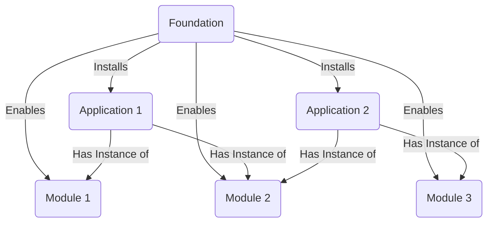

```mermaid
graph TD
    F(Foundation) -->|Installs| A1(Application 1)
    F -->|Installs| A2(Application 2)
    F -->|Enables| M1(Module 1)
    F -->|Enables| M2(Module 2)
    F -->|Enables| M3(Module 3)

    A1 -->|Has Instance of| M1
    A1 -->|Has Instance of| M2
    A2 -->|Has Instance of| M2
    A2 -->|Has Instance of| M3
```
